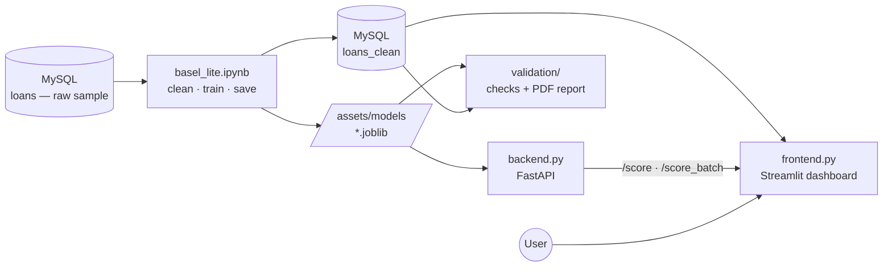

# Basel-Lite — Credit Risk & Capital Engine

> An end-to-end credit risk system on real LendingClub data: it estimates a borrower's **probability of default**, assigns a **300–850 credit score**, measures **loss given default** from real recoveries, and rolls everything up into a portfolio **Expected Loss** — the capital a bank would reserve. Built as a full stack: a modeling notebook, a FastAPI service, and a live Streamlit dashboard — and shipped with an independent **model-validation layer** that regenerates a pass/fail report.


**Report authors:** Ailya Shah  

**Program:** Department of Computer Science, CS-245 Machine Learning  
**Repository owner / author note:** Ailya Shah, Data Science at SEECS
##
## Abstract
Banks lose money when borrowers default, and the hard part isn't lending — it's pricing that risk before it happens. Basel-Lite is an end-to-end credit risk system that does exactly that, built on a 200,000-loan sample of the 2007–2018 LendingClub book (≈119,000 *completed* loans used for modeling, after dropping still-current ones). It estimates each borrower's probability of default with a calibrated LightGBM model, assigns a 300–850 credit score using a Weight-of-Evidence scorecard like the ones banks actually deploy, and measures loss given default straight from real recovery data. Those pieces combine into the Basel formula — Expected Loss = PD × LGD × EAD — to compute the capital a lender should reserve, loan by loan and across a sampled book. Every model uses only information available at application time, so there's no data leakage inflating the results. The whole thing ships as a real stack: a MySQL data layer, a FastAPI scoring service, and a live Streamlit dashboard where dragging a borrower's FICO score watches their default risk and expected loss recalculate in real time. SHAP explains every prediction, calibration curves prove the probabilities are trustworthy, and survival analysis models when defaults strike, not just whether. On top of the model sits an **independent validation layer** — a reproducible, test-backed pipeline that re-scores a held-out slice and checks discrimination, calibration, stability, rank monotonicity, leakage, and a champion-vs-challenger benchmark, then emits a PDF validation report. It's not a notebook — it's a deployable risk engine, shipped with the second-line checks a real risk desk would demand.

##

##

---

## What it does

- **Probability of Default (PD)** — a calibrated LightGBM model trained on application-time features only (no leakage).
- **Credit scorecard** — a Weight-of-Evidence + logistic scorecard scaled to a 300–850 range, the way regulated credit scores are actually built.
- **Loss Given Default (LGD)** — measured empirically from real recovery data on charged-off loans.
- **Expected Loss** — `EL = PD × LGD × EAD`, computed per loan and aggregated to a portfolio number.
- **Timing of default** — survival analysis (Kaplan–Meier + Cox) for *when* defaults happen, on top of *whether* they happen.
- **Independent validation** — a `validation/` package that re-scores a holdout and runs seven acceptance checks as a `pytest` suite, then renders a PDF validation report.
- **Live app** — a borrower scorer that updates as you drag the sliders, plus a portfolio dashboard that values a sampled slice of the book in one click.

---

## The app

### Live borrower scorer
Set a borrower's profile and the assessment updates instantly — probability of default, a credit-score gauge that fills green → amber → red, the risk band, and the expected loss on that loan, broken down into `PD × LGD × EAD`.


Every input is adjustable, with the finer credit-history fields tucked into an expander:


### Portfolio risk
Sample any number of loans from the book and value them in one pass — total exposure, total expected loss, loss rate, average PD, and the loss broken down by credit grade.


---

## How it works

### Data & leakage control
The model is trained on a sample of the **LendingClub 2007–2018** loan book. The target is built from loan status — *Charged Off* = default (1), *Fully Paid* = good (0), with in-progress loans dropped. Crucially, only features **known at application time** are used; post-origination fields (`recoveries`, `total_pymnt`, last-pull FICO, etc.) are excluded so the model can't "cheat" by seeing the outcome.

### Feature strength — Information Value
Every feature is binned and scored by Information Value, the standard way a credit team ranks predictors before building a scorecard.

### Probability of Default — model performance
A calibrated LightGBM classifier, evaluated with the metrics banks actually use (AUC, KS, Gini), and then calibrated so its outputs are true probabilities — essential for the expected-loss math.


### Explainability — SHAP
Which features drive each prediction, and in which direction.


### Loss Given Default
Measured from actual recoveries on charged-off loans, not assumed.


### When defaults happen — survival analysis
A Kaplan–Meier curve for how loan survival decays over time.


### Exploratory findings
Default rate climbs cleanly across LendingClub's own risk grades — a sanity check that the target is correct.


---

## Results

*Numbers below are the exact values printed by the notebook on the current 200K sample; they will shift slightly if you resample.*

| Metric | Value |
|---|---|
| Modeling sample (completed loans) | 119,060 |
| Portfolio default rate | 19.8% |
| Average recovery rate (measured) | 37.8% |
| Average LGD (measured) | 62.2% |
| PD model — ROC AUC | 0.713 |
| PD model — KS | 0.312 |
| PD model — Gini | 0.427 |
| Test-set average PD | 19.9% |
| Test-set Expected Loss rate | 13.3% of exposure |

---

## Model validation

Building a model is the first line; **checking it is the second.** The `validation/`
package acts as an independent reviewer: it loads the saved artifacts, re-scores a
fixed-seed holdout the exact way the API does, and runs seven acceptance checks —
encoded as a `pytest` suite and rendered into a PDF report. Every check has an
explicit, tunable threshold in `validation/config.py`; a *failing* check is a
documented finding, not a crash.

**Latest run — all checks passing on the LendingClub holdout:**

| Check | Result | Status |
|---|---|---|
| Leakage | No post-origination fields in the feature set | ✅ Pass |
| Discrimination — Gini | 0.426 (AUC 0.713) | ✅ Pass |
| Discrimination — KS | 0.308 | ✅ Pass |
| Calibration | Expected calibration error 0.009 (Brier 0.144) | ✅ Pass |
| Stability — PSI | 0.000 (train → holdout) | ✅ Pass |
| Rank monotonicity | Spearman −1.000 (score band vs default rate) | ✅ Pass |
| Champion vs challenger | Gini 0.426 vs logistic 0.419 (Δ +0.007) | ✅ Pass |

📄 Full report: [`validation/report/basel_lite_validation.pdf`](validation/report/basel_lite_validation.pdf)

**What the results mean.** The calibrated PDs sit within roughly one percentage
point of observed default rates across deciles (ECE 0.009), which is precisely what
licenses feeding them straight into `EL = PD × LGD × EAD` — an uncalibrated ranker
would distort the capital number even with the same AUC. Rank ordering is clean
(Spearman −1.000): default rate falls monotonically across every score band with no
reversals.

The champion-vs-challenger check is the honest one. The LightGBM beats a plain
WoE-logistic regression by only **0.007 Gini** — a documented finding, not a
failure. It says most of the signal is already captured linearly through the WoE
transform, so the simpler, more interpretable logistic model is a defensible
production choice; the GBM is retained here for the marginal lift and the
explainability tooling around it.

**Run it:**

```bash
python -m validation.run          # prints the pass/fail summary + writes the PDF
pytest validation/tests -v        # runs the seven checks as tests
```

The validator reads the same `loans_clean` table the dashboard uses (via
`BASEL_DB_URL`); set `BASEL_VALIDATION_DATA=<file.parquet>` to run offline / in CI.

> **Note — PSI scope.** The stability check currently compares the development
> sample against the holdout (in-sample). A true *out-of-time* PSI across loan
> vintages requires persisting `issue_d` into `loans_clean`; that's the next
> planned extension.

---

## Architecture



The notebook cleans the raw `loans` sample, writes `loans_clean`, and saves the trained models; FastAPI loads the models and serves predictions; Streamlit reads `loans_clean` for the portfolio view and calls the API for scoring; the validation layer reads the same artifacts and data to produce its report.

---

## Project structure

```
basel_lite/
├── basel_lite.ipynb        # full modeling pipeline: clean → EDA → scorecard → PD/LGD → EL → survival
├── backend.py              # FastAPI service: /score, /score_batch, /health
├── frontend.py             # Streamlit dashboard: live scorer + portfolio view
├── validation/             # independent model-validation layer
│   ├── metrics.py          # generic checks: Gini, KS, PSI, calibration, monotonicity
│   ├── config.py           # Basel-Lite specifics: paths, split, leakage list, thresholds
│   ├── data.py             # loads artifacts + holdout, runs the scoring pipeline
│   ├── validate.py         # runs all checks → results
│   ├── report.py           # results → PDF report
│   ├── run.py              # validate + report in one command
│   ├── report/             # generated: basel_lite_validation.pdf
│   └── tests/              # pytest acceptance criteria (one per check)
├── .streamlit/
│   └── config.toml         # dark theme
├── assets/
│   ├── images/             # charts, generated by the notebook (Section 12)
│   └── models/             # trained artifacts: pd_model, binning, scorecard, model_meta
├── app-ss/                 # app screenshots (used in this README)
├── .env.example            # template for BASEL_DB_URL / BASEL_API_URL (copy to .env)
├── requirements.txt
├── .gitignore
└── README.md
```

---

## Getting started

### Prerequisites
- Python 3.11+
- MySQL (with a schema named `basel_lite`)

### 1. Get the data
Download the LendingClub accepted-loans file from Kaggle
(`wordsforthewise/lending-club`) and load a sample into a `loans` table in MySQL.
Running the notebook's cleaning cells then writes the modeling-ready `loans_clean`
table (the dashboard's Portfolio page reads from it). The raw data is **not**
committed to this repo.

### 2. Install dependencies & configure secrets
```bash
python -m venv .venv
# activate it, then:
pip install -r requirements.txt

# copy the env template and fill in your MySQL URL
cp .env.example .env        # Windows: copy .env.example .env
```
`.env` holds `BASEL_DB_URL` (and optionally `BASEL_API_URL`); it is gitignored, so
no credentials live in the repo.

### 3. Train the models
Open `basel_lite.ipynb`, select the `.venv` kernel, and run all cells top to bottom.
This saves four artifacts into `assets/models/` and the charts into `assets/images/`.

### 4. Start the backend
```bash
uvicorn backend:app --reload
```
Interactive API docs at <http://127.0.0.1:8000/docs>.

### 5. Start the frontend (new terminal)
```bash
streamlit run frontend.py
```
Opens at <http://localhost:8501>.

### 6. Validate the model (optional, any time)
```bash
python -m validation.run
```
Prints the pass/fail summary and writes `validation/report/basel_lite_validation.pdf`.

---

## Tech stack

| Layer | Tool |
|---|---|
| Data store | MySQL |
| Modeling | LightGBM, optbinning (WoE scorecard), scikit-learn, lifelines |
| Explainability | SHAP |
| Backend | FastAPI + Uvicorn |
| Frontend | Streamlit + Plotly |
| Validation | pytest (acceptance checks), matplotlib (PDF report) |

---

## Notes & limitations

- **Sampled book** — the current run uses a 200K-loan sample of the LendingClub file (≈119K completed loans); portfolio figures are for that sample, not the full 2.2M-loan book.
- **EAD** is approximated by the loan amount; a production model would use outstanding principal at default.
- **LGD** uses a portfolio-average recovery rate; a fuller model would predict LGD per loan.
- **PSI is in-sample** — the stability check compares development vs holdout; a true out-of-time comparison across loan vintages needs `issue_d` persisted into `loans_clean` (planned).
- Grade, sub-grade and interest rate are LendingClub's own risk pricing, so they carry high predictive power but partly encode the answer — the more independent signals are FICO, DTI, term, and income.
- The model is a prototype for learning and portfolio purposes, not a production credit decision system.