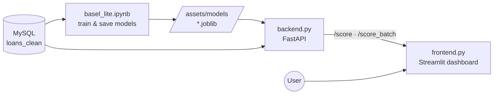

# Basel-Lite — Credit Risk & Capital Engine

> An end-to-end credit risk system on real LendingClub data: it estimates a borrower's **probability of default**, assigns a **300–850 credit score**, measures **loss given default** from real recoveries, and rolls everything up into a portfolio **Expected Loss** — the capital a bank would reserve. Built as a full stack: a modeling notebook, a FastAPI service, and a live Streamlit dashboard.


**Report authors:** Ailya Shah  

**Program:** Department of Computer Science, CS-245 Machine Learning  
**Repository owner / author note:** Ailya Shah, Data Science at SEECS
##
## Abstract
Banks lose money when borrowers default, and the hard part isn't lending — it's pricing that risk before it happens. Basel-Lite is an end-to-end credit risk system built on 2.2 million real LendingClub loans that does exactly that. It estimates each borrower's probability of default with a calibrated LightGBM model, assigns a 300–850 credit score using a Weight-of-Evidence scorecard like the ones banks actually deploy, and measures loss given default straight from real recovery data. Those pieces combine into the Basel formula — Expected Loss = PD × LGD × EAD — to compute the capital a lender should reserve, loan by loan and across the entire book. Every model uses only information available at application time, so there's no data leakage inflating the results. The whole thing ships as a real stack: a MySQL data layer, a FastAPI scoring service, and a live Streamlit dashboard where dragging a borrower's FICO score watches their default risk and expected loss recalculate in real time. SHAP explains every prediction, calibration curves prove the probabilities are trustworthy, and survival analysis models when defaults strike, not just whether. It's not a notebook — it's a deployable risk engine. From raw loan data to a clickable capital model, the way a real risk desk would build it.

##

##

---

## What it does

- **Probability of Default (PD)** — a calibrated LightGBM model trained on application-time features only (no leakage).
- **Credit scorecard** — a Weight-of-Evidence + logistic scorecard scaled to a 300–850 range, the way regulated credit scores are actually built.
- **Loss Given Default (LGD)** — measured empirically from real recovery data on charged-off loans.
- **Expected Loss** — `EL = PD × LGD × EAD`, computed per loan and aggregated across the whole book.
- **Macro-aware risk** — survival analysis for *when* defaults happen, on top of *whether* they happen.
- **Live app** — a borrower scorer that updates as you drag the sliders, plus a portfolio dashboard that values the entire loan book in one click.

---

## The app

### Live borrower scorer
Set a borrower's profile and the assessment updates instantly — probability of default, a credit-score gauge that fills green → amber → red, the risk band, and the expected loss on that loan, broken down into `PD × LGD × EAD`.


Every input is adjustable, with the finer credit-history fields tucked into an expander:


### Portfolio risk
Sample any number of loans from the book and value them in one pass — total exposure, total expected loss, loss rate, average PD, and the loss broken down by credit grade.


---

## How it works

### Data & leakage control
The model is trained on the **LendingClub 2007–2018** loan book. The target is built from loan status — *Charged Off* = default (1), *Fully Paid* = good (0), with in-progress loans dropped. Crucially, only features **known at application time** are used; post-origination fields (`recoveries`, `total_pymnt`, last-pull FICO, etc.) are excluded so the model can't "cheat" by seeing the outcome.

### Feature strength — Information Value
Every feature is binned and scored by Information Value, the standard way a credit team ranks predictors before building a scorecard.

### Probability of Default — model performance
A calibrated LightGBM classifier, evaluated with the metrics banks actually use (AUC, KS, Gini), and then calibrated so its outputs are true probabilities — essential for the expected-loss math.


### Explainability — SHAP
Which features drive each prediction, and in which direction.


### Loss Given Default
Measured from actual recoveries on charged-off loans, not assumed.


### When defaults happen — survival analysis
A Kaplan–Meier curve for how loan survival decays over time.


### Exploratory findings
Default rate climbs cleanly across LendingClub's own risk grades — a sanity check that the target is correct.


---

## Results

> Replace the model figures below with the exact numbers your notebook prints on your data.

| Metric | Value |
|---|---|
| Portfolio default rate | 19.8% |
| Average LGD (measured) | ~62% |
| PD model — ROC AUC | ~0.71 |
| PD model — KS | ~0.31 |
| PD model — Gini | ~0.42 |
| Portfolio Expected Loss rate | ~9% of exposure |

---

## Architecture



The notebook trains and saves the models; FastAPI loads them and serves predictions; Streamlit is the UI that calls the API.

---

## Project structure

```
basel_lite/
├── basel_lite.ipynb        # full modeling pipeline: clean → EDA → scorecard → PD/LGD → EL → survival
├── backend.py              # FastAPI service: /score, /score_batch, /health
├── frontend.py             # Streamlit dashboard: live scorer + portfolio view
├── .streamlit/
│   └── config.toml         # dark theme
├── assets/
│   ├── images/             # charts, generated by the notebook (Section 12)
│   └── models/             # trained artifacts: pd_model, binning, scorecard, model_meta
├── app-ss/                 # app screenshots (used in this README)
├── .gitignore
└── README.md
```

---

## Getting started

### Prerequisites
- Python 3.11+
- MySQL (with a schema named `basel_lite`)

### 1. Get the data
Download the LendingClub accepted-loans file from Kaggle
(`wordsforthewise/lending-club`), then run the sampling + cleaning cells in the
notebook to build the `loans` and `loans_clean` tables in MySQL. The raw data
is **not** committed to this repo.

### 2. Install dependencies
```bash
python -m venv .venv
# activate it, then:
pip install pandas numpy scikit-learn lightgbm optbinning shap matplotlib lifelines \
            sqlalchemy pymysql joblib fastapi "uvicorn[standard]" streamlit plotly requests
```

### 3. Train the models
Open `basel_lite.ipynb`, select the `.venv` kernel, and run all cells top to bottom.
This saves four artifacts into `assets/models/` and the charts into `assets/images/`.

### 4. Start the backend
```bash
uvicorn backend:app --reload
```
Interactive API docs at <http://127.0.0.1:8000/docs>.

### 5. Start the frontend (new terminal)
```bash
streamlit run frontend.py
```
Opens at <http://localhost:8501>.

---

## Tech stack

| Layer | Tool |
|---|---|
| Data store | MySQL |
| Modeling | LightGBM, optbinning (WoE scorecard), scikit-learn, lifelines |
| Explainability | SHAP |
| Backend | FastAPI + Uvicorn |
| Frontend | Streamlit + Plotly |

---

## Notes & limitations

- **EAD** is approximated by the loan amount; a production model would use outstanding principal at default.
- **LGD** uses a portfolio-average recovery rate; a fuller model would predict LGD per loan.
- Grade, sub-grade and interest rate are LendingClub's own risk pricing, so they carry high predictive power but partly encode the answer — the more independent signals are FICO, DTI, term, and income.
- The model is a prototype for learning and portfolio purposes, not a production credit decision system.